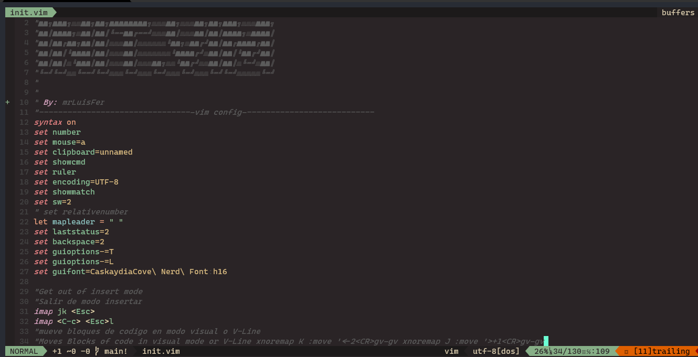

# 📗 mrLuisFer's - Neovim Config


Una explicación de cómo usar esta configuración en Windows está en [este video - Youtube.com](https://www.youtube.com/channel/UCw1Ipy5_P1OL0zUJMfYC7-A)

## ⚡ Acerca De

Esta es mi configuración personal y adaptada a mis necesidades, pero se puede adaptar fácilmente a cualquier configuración, así como a archivos vim separados.

Esto se adaptará para sistemas **Windows** y **Linux**
Y corregirán las cosas en el futuro

### 🌱 Contribuir

Puede contribuir haciendo una **pull request** con cualquier _corrección_ o _función_ que desee agregar

Si no tiene una idea, puede seguir estos pasos:

- Hacer un **fork** del proyecto (opcional en caso de que tenga un error de permiso)
  O clonarlo en su máquina local

- Crear una nueva rama:

  ```bash
  git checkout -b <new branch>
  ```

- Cuando tenga todos los cambios hechos, has:

  ```bash
  git add .
  ```

  ```bash
  git commit -m "a description"
  ```

  ```bash
  git push origin <new branch>
  ```

Y has un **pull request** a la rama **main**

### 📦 Dependencias

- **Vim-Plug**

- **Git**

- **RipGrep**

- **nvim** C:

## 🦄 Como usarlo
Al clonar el repositorio, en caso de que la carpeta se llame *neovim-dotfiles*, cambie el nombre a **nvim** para que Neovim lo reconozca

### 📚 Install Neovim:
  Para **Windows** puedes utilizar **powershell**, y puedes usar **choco** o **scoop**
  ```
  scoop install neovim
  
  # Or

  choco install neovim -y
  ```
  
  Puedes revisar la documentacion para **Linux** y **MacOs**: [neovim/wiki/Installing-Neovim](https://github.com/neovim/neovim/wiki/Installing-Neovim)
  
### 🌙 Instalar Manejador
  En esta config se utiliza **vim-plug** para manejar e instalar **plugins**

  Para instalar **Vim Plug** puedes ejecutar alguno de estos comandos

  Linux, Unix
  ```bash
    sh -c 'curl -fLo "${XDG_DATA_HOME:-$HOME/.local/share}"/nvim/site/autoload/plug.vim --create-dirs \
         https://raw.githubusercontent.com/junegunn/vim-plug/master/plug.vim'
  ```
  
  Linux (Flatpak)
  ```bash
  curl -fLo ~/.var/app/io.neovim.nvim/data/nvim/site/autoload/plug.vim \
    https://raw.githubusercontent.com/junegunn/vim-plug/master/plug.vim
  ```
  
  Windows (Powershell)
  ```bash
  iwr -useb https://raw.githubusercontent.com/junegunn/vim-plug/master/plug.vim |`
    ni "$(@($env:XDG_DATA_HOME, $env:LOCALAPPDATA)[$null -eq $env:XDG_DATA_HOME])/nvim-data/site/autoload/plug.vim" -Force
  ```
  
  Mas informacion acerca de **vim-plug**:
  - [Documentation](https://github.com/junegunn/vim-plug)
  - [Tutorial](https://github.com/junegunn/vim-plug/wiki/tutorial)
  - [Requirements](https://github.com/junegunn/vim-plug/wiki/requirements)
  
### 📘 Configurar en Windows:
  ```
  cd %APPDATA\Local\nvim
  ```
  
  Si no tiene la **carpeta nvim** haga esto: (si la tiene, ignore este paso)
  ```bash
  mkdir nvim
  
  cd nvim
  ```
  
  ```bash
  git clone -b main https://github.com/mrLuisFer/neovim-dotfiles.git .
  
  echo "Cloned the configuration :D"
  ```


### 🐧 Configurar Linux:
  ```
  mkdir -p $HOME/.config/nvim
  
  cd $HOME/.config/nvim
  
  git clone -b main https://github.com/mrLuisFer/neovim-dotfiles.git .
  
  echo "Cloned the configuration :D"
  ```

### 🍎 Configurar MacOs:
  ```
  mkdir -p $HOME/.config/nvim
  
  cd $HOME/.config/nvim
  
  git clone -b main https://github.com/mrLuisFer/neovim-dotfiles.git .
  
  echo "Cloned the configuration :D"
  ```

### 🌈 Esquema de Colores
Si no te gusta el color que viene por defecto, puedes ejecutar el comando dentro de **neovim:** `: colorscheme + TAB` y verás una lista de temas que puedes seleccionar

Cuando encuentres uno que te guste, ve a `init.vim` y busca con `/colorscheme` dentro de **nvim** y escribe el nombre del **tema** que quieres usar

## 🐊 Extensiones CoC
[Que es Coc?](https://github.com/neoclide/coc.nvim)

Si quieres instalar o añadir una **extensión** para **Coc** puedes consultar la siguiente página y sin modificar nada a menos que sea necesario, simplemente **ejecuta el comando** y estará listo para utilizar

Por ejemplo:

```
:CocInstall coc-json coc-tsserver
```

[You can find more extensions here](https://github.com/neoclide/coc.nvim/wiki/Using-coc-extensions)

## ⚠ Advertencia

Puede ser que cuando ingrese a la configuración clonada en neovim **por primera vez**, obtenga múltiples errores

No se preocupe, solo presione `Enter` y ejecute **:PlugInstall**
Se descargarán varios plugins, luego **salga y entre a neovim**

## 🐙 Cambiar Repositorio

Si quieres cambiar el repositorio utilizando esta config, pero con tus propias configuraciones y/o adaptar a tus necesidades

Otra forma es cambiando el **git-remote**, siguiendo estos pasos:

- Para ver las lista de los remotos que estan en el repositiorio
```bash
git remote -v
```

- Para remover ese remoto, ejecuta:
```bash
git remote remove origin
```

- Y añadir el nuevo remoto de tu repositorio
```bash
git remote add origin <url del repo>
```
