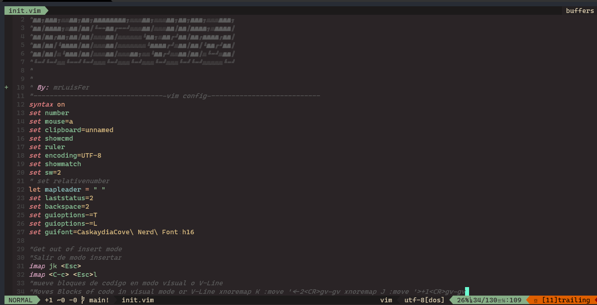
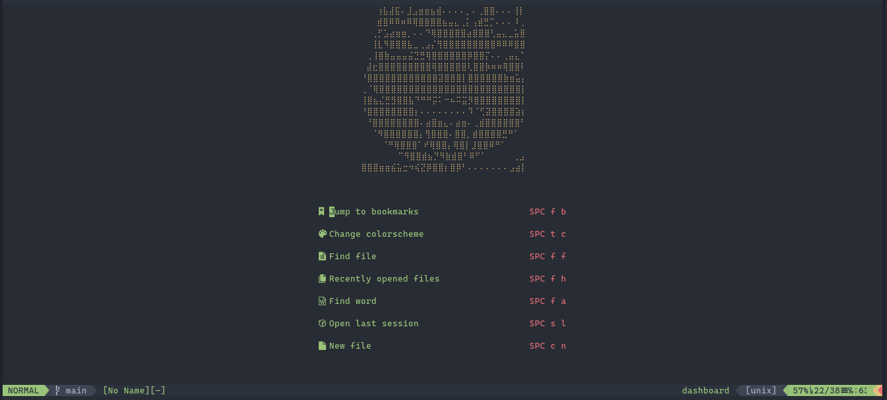

# 📗 mrLuisFer's - Neovim Config


An explanation of how to use this config in Windows is in [this video - Youtube.com](https://www.youtube.com/channel/UCw1Ipy5_P1OL0zUJMfYC7-A)

Leer el [readme en español?](./README-es.md)

## ⚡ About

This is my personal config and adapted to my needs, but it can be easily adapted to any config, as well as separate vim files

This will be adapted for **Windows** and **Linux** systems
And they will correct things in the future

### 🌱 Contribute

You can contribute by making a **pull request** with any _fix_ or _feature_ that you want to add :D

If you don't have an idea, you can follow these steps:

- Fork the project (optional in case you have a permission error)
  Or clone it on your local machine

- Create a new branch with:

  ```bash
  $ git checkout -b <new branch>
  ```

- When you have all the changes you have:

  ```bash
  $ git add .
  ```

  ```bash
  $ git commit -m "a description"
  ```

  ```bash
  $ git push origin <new branch>
  ```

And do a **pull request** to the **main** branch

### 📦 Requirements

- **Vim-Plug**

- **Git**

- [**RipGrep**](https://github.com/BurntSushi/ripgrep)

- **Neovim** C:

## 🔥 Important

For a good operation of this configuration and to take **advantage of all** the Plugins, we recommend you to use **version 0.5 or higher
** that adds many improvements and support for many things

More information below:
[Official Documentation](https://github.com/neovim/neovim/wiki/Installing-Neovim)
[Releases](https://github.com/neovim/neovim/releases)

## 🦄 Usage
When cloning the repository, in case the folder is named *neovim-dotfiles*, change the name to **nvim** so that Neovim recognizes it

### 📚 Install Neovim:
  For **Windows** run one of the two commands within **powershell**, you can use **choco** or **scoop**
  ```
  $ scoop install neovim
  
  # Or

  $ choco install neovim -y
  ```
  
  And for **Linux** and **MacOs** : [neovim/wiki/Installing-Neovim](https://github.com/neovim/neovim/wiki/Installing-Neovim)
  
### 🌙 Install Manager:
  In this config use vim plug to handle and install plugins

  To install **Vim Plug** you can run any of these commands

  Linux, Unix
  ```bash
    sh -c 'curl -fLo "${XDG_DATA_HOME:-$HOME/.local/share}"/nvim/site/autoload/plug.vim --create-dirs \
         https://raw.githubusercontent.com/junegunn/vim-plug/master/plug.vim'
  ```
  
  Linux (Flatpak)
  ```bash
  curl -fLo ~/.var/app/io.neovim.nvim/data/nvim/site/autoload/plug.vim \
    https://raw.githubusercontent.com/junegunn/vim-plug/master/plug.vim
  ```
  
  Windows (Powershell)
  ```bash
  iwr -useb https://raw.githubusercontent.com/junegunn/vim-plug/master/plug.vim |`
    ni "$(@($env:XDG_DATA_HOME, $env:LOCALAPPDATA)[$null -eq $env:XDG_DATA_HOME])/nvim-data/site/autoload/plug.vim" -Force
  ```
  
  More information about vim plug:
  - [Documentation](https://github.com/junegunn/vim-plug)
  - [Tutorial](https://github.com/junegunn/vim-plug/wiki/tutorial)
  - [Requirements](https://github.com/junegunn/vim-plug/wiki/requirements)
  
### 📘 Setup Windows:
  ```
  $ cd %APPDATA\Local\nvim
  ```
  
  If you don't have **the nvim folder** do this: (if you have it, ignore this step)
  ```bash
  $ mkdir nvim
  
  $ cd nvim
  ```
  
  ```bash
  $ git clone -b main https://github.com/mrLuisFer/neovim-dotfiles.git .
  
  # echo "Cloned the configuration :D"
  ```


### 🐧 Setup Linux:
  ```
  $ mkdir -p $HOME/.config/nvim
  
  $ cd $HOME/.config/nvim
 
  $ git clone -b main https://github.com/mrLuisFer/neovim-dotfiles.git .
  
  # echo "Cloned the configuration :D"
  ```

### 🍎 Setup MacOs:
  ```
  $ mkdir -p $HOME/.config/nvim
  
  $ cd $HOME/.config/nvim
  
  $ git clone -b main https://github.com/mrLuisFer/neovim-dotfiles.git .
  
  # "Cloned the configuration :D"
  ```

### 🌈 Colorschemes
If you do not like the color that comes by default, you can execute the command inside **neovim:** `:colorscheme + TAB` and you will see a list of themes that you can select

When you find one you like, go to `init.vim` and search with *neovim* `/colorscheme` and write down the name of the **theme** you want to use.

## 🐊 CoC Extensions
[Whats Coc?](https://github.com/neoclide/coc.nvim)

If you want to **install** or **add** an extension for **Coc** you can check the following page and without modifying anything unless necessary, just **run the command** and it will be ready to use

Install extensions like:

```
:CocInstall coc-json coc-tsserver
```
[You can find more extensions here](https://github.com/neoclide/coc.nvim/wiki/Using-coc-extensions)

## ⚠ Warning

It may be that when you enter the cloned configuration in nvim for the first time, you will get multiple errors

But don't worry just press `Enter` and run this command **:PlugInstall**
Several plugins will be downloaded, then **exit and enter neovim again**


## 🐙 Change Repository

If you want to change the repository using this config, but with your own configurations and / or adapt to your needs

Another way is by changing the **git-remote**, following these steps:

- To see the list of remotes that are in the repository
```sh
$ git remote -v
```

- To remove that remote, run:
```sh
$ git remote remove origin
```

- And add the new remote from your repository
```sh
$ git remote add origin <url del repo>
```

## 📔 Vim Dashboard


If you want neovim to show you a dashboard screen similar to this one, you need certain things

The most important is that you need [Neovim 0.5 or higher](https://github.com/neovim/neovim/wiki/Installing-Neovim)

You also need **[Ripgrep](https://github.com/BurntSushi/ripgrep)**, this is for the operation of search engines for files, words, history, etc.

- [BurntSushi/ripgrep](https://github.com/BurntSushi/ripgrep)

You also need to have **[FZF](https://github.com/junegunn/fzf)** installed, this is already included in the configuration but if it shows you an error you can read the documentation

- [junegunn/fzf](https://github.com/junegunn/fzfv)

An alternative that you can use is **[Vim Clap](https://github.com/liuchengxu/vim-clap/)**, it also comes inside the config but you can check its documentation

- [liuchengxu/vim-clap](https://github.com/liuchengxu/vim-clap/)

And obviously you can check out the original repository from **vim dashboard creator**

- [glepnir/dashboard-nvim](https://github.com/glepnir/dashboard-nvim)

## RipGrep

To **install RipGrep** on your pc you can use one of the following commands

If you're a **macOS Homebrew** or a **Linuxbrew** user, then you can install
ripgrep from homebrew-core:

### 🍎 MacOs
```
$ brew install ripgrep
```

If you're a **MacPorts** user, then you can install ripgrep from the
[official ports](https://www.macports.org/ports.php?by=name&substr=ripgrep):

```
$ sudo port install ripgrep
```

### 📘 Windows

If you're a **Windows Chocolatey** user, then you can install ripgrep from the
[official repo](https://chocolatey.org/packages/ripgrep):

```
$ choco install ripgrep
```

If you're a **Windows Scoop** user, then you can install ripgrep from the
[official bucket](https://github.com/ScoopInstaller/Main/blob/master/bucket/ripgrep.json):

```
$ scoop install ripgrep
```

### 🐧 Linux

If you're an **Arch Linux** user, then you can install ripgrep from the official repos:

```sh
$ pacman -S ripgrep
```

If you're a **Gentoo** user, you can install ripgrep from the
[official repo](https://packages.gentoo.org/packages/sys-apps/ripgrep):

```sh
$ emerge sys-apps/ripgrep
```

If you're a **Fedora** user, you can install ripgrep from official
repositories.

```sh
$ sudo dnf install ripgrep
```

If you're an **openSUSE** user, ripgrep is included in **openSUSE Tumbleweed**
and **openSUSE Leap** since 15.1.

```sh
$ sudo zypper install ripgrep
```

If you're a **RHEL/CentOS 7/8** user, you can install ripgrep from
[copr](https://copr.fedorainfracloud.org/coprs/carlwgeorge/ripgrep/):

```sh
$ sudo yum-config-manager --add-repo=https://copr.fedorainfracloud.org/coprs/carlwgeorge/ripgrep/repo/epel-7/carlwgeorge-ripgrep-epel-7.repo
$ sudo yum install ripgrep
```

If you're a **Nix** user, you can install ripgrep from
[nixpkgs](https://github.com/NixOS/nixpkgs/blob/master/pkgs/tools/text/ripgrep/default.nix):

```sh
$ nix-env --install ripgrep
$ # (Or using the attribute name, which is also ripgrep.)
```

If you're a **Debian** user (or a user of a Debian derivative like **Ubuntu**),
then ripgrep can be installed using a binary `.deb` file provided in each
[ripgrep release](https://github.com/BurntSushi/ripgrep/releases).

```sh
$ curl -LO https://github.com/BurntSushi/ripgrep/releases/download/12.1.1/ripgrep_12.1.1_amd64.deb
$ sudo dpkg -i ripgrep_12.1.1_amd64.deb
```

If you run Debian Buster (currently Debian stable) or Debian sid, ripgrep is
[officially maintained by Debian](https://tracker.debian.org/pkg/rust-ripgrep).
```
$ sudo apt-get install ripgrep
```

If you're an **Ubuntu Cosmic (18.10)** (or newer) user, ripgrep is
[available](https://launchpad.net/ubuntu/+source/rust-ripgrep) using the same
packaging as Debian:

```sh
$ sudo apt-get install ripgrep
```

If you're a **FreeBSD** user, then you can install ripgrep from the
[official ports](https://www.freshports.org/textproc/ripgrep/):

```sh
# pkg install ripgrep
```

If you're an **OpenBSD** user, then you can install ripgrep from the
[official ports](https://openports.se/textproc/ripgrep):

```sh
$ doas pkg_add ripgrep
```

If you're a **NetBSD** user, then you can install ripgrep from
[pkgsrc](https://pkgsrc.se/textproc/ripgrep):

```sh
# pkgin install ripgrep
```

If you're a **Haiku x86_64** user, then you can install ripgrep from the
[official ports](https://github.com/haikuports/haikuports/tree/master/sys-apps/ripgrep):

```sh
$ pkgman install ripgrep
```

If you're a **Haiku x86_gcc2** user, then you can install ripgrep from the
same port as Haiku x86_64 using the x86 secondary architecture build:

```sh
$ pkgman install ripgrep_x86
```

If you're a **Rust programmer**, ripgrep can be installed with `cargo`.

* Note that the minimum supported version of Rust for ripgrep is **1.34.0**,
  although ripgrep may work with older versions.
* Note that the binary may be bigger than expected because it contains debug
  symbols. This is intentional. To remove debug symbols and therefore reduce
  the file size, run `strip` on the binary.

```sh
$ cargo install ripgrep
```

If your **OS doesn't appear**, you can search the official repository

Made with 💙 [by mrLuisFer](https://mrluisfer-linktry.netlify.app/)
